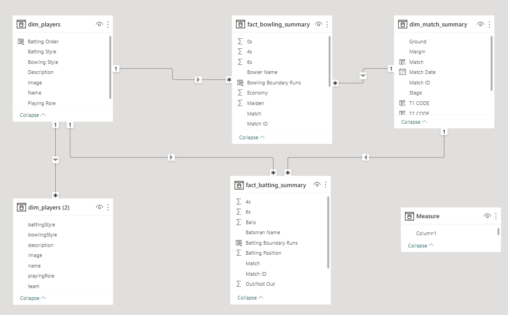
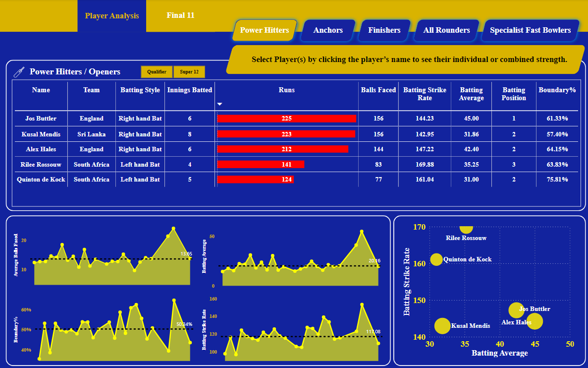
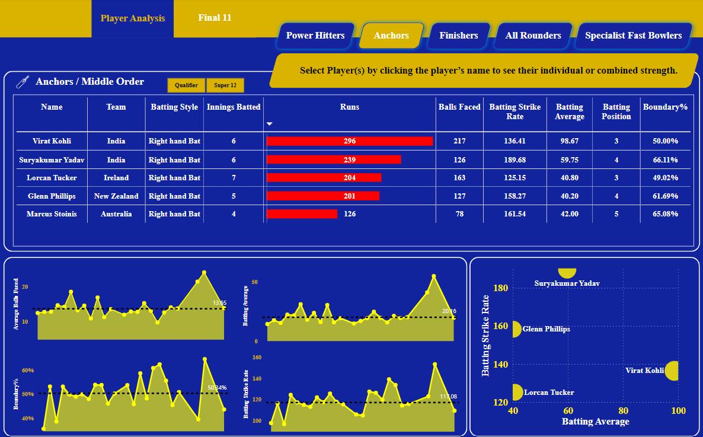
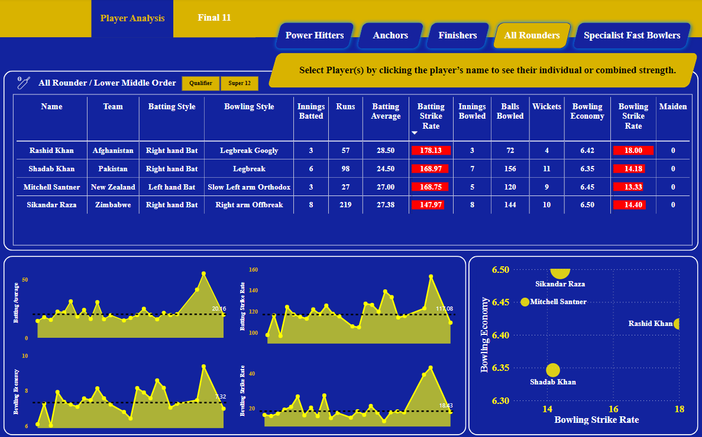
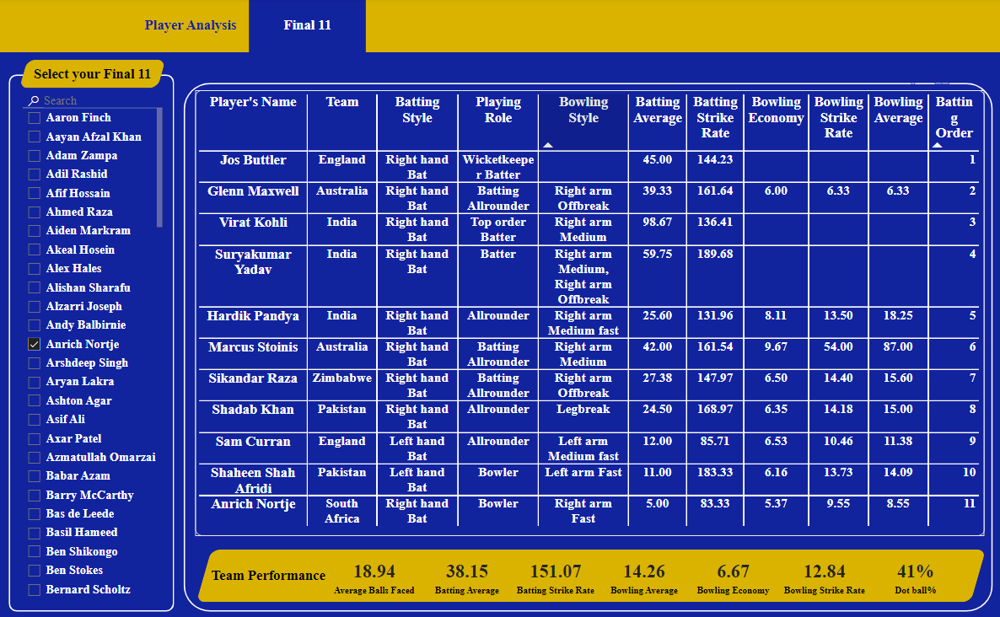

# Cricket-Data-Analysis
This project involved creating a Cricket Dashboard using Power BI to visualize and analyze cricket data. The process included collecting data from reliable sources, cleaning and transforming the data using Power Query, and designing interactive visualizations using Power BI's versatile tools.

## Key Features of the Dashboard

✅ Player Profiles: Access detailed profiles of your favorite players, including their career records, batting and bowling averages, and more.

✅ Team Creation: Build your own dream team by selecting players from a comprehensive player database and analyzing their combined statistics and performance.

✅ Team Performance: Analyze team performance metrics, such as win/loss ratios, run rates, and player contributions.

✅ Match Analysis: Dive into in-depth match analysis, including graphical representations of key performance indicators and player comparisons.

✅ Historical Data: Explore historical data of players, teams, and matches, spanning decades of cricketing history.

✅ Trend Analysis: Identify emerging trends and patterns in the game, leveraging visualizations and statistical models.

## Data Model


## Dashboard
### Power Hitters / Openers


### New Anchors / Middle Order


### New Finisher / Lower Order Anchor


### New All Rounders / Lower Middle Order


### New Specialist Fast Bowlers / Tail End


### New Final 11


## Want to create dashboard like this?
#### [Refer This](https://www.youtube.com/watch?v=4QkYy1wANXA&t=3285s)
#### [Related Projects](https://codebasics.io/resources)

## How to run?
### Clone the repository
```bash
  https://github.com/harshmehta01/Cricket-Data-Analysis.git
```
### ... OR Create a new repository on the command line
```bash
  git init
  git add README.md
  git commit -m "first commit"
  git branch -M main
  git remote add origin https://github.com/harshmehta01/Cricket-Data-Analysis.git
  git push -u origin main
```
### ... OR Push an existing repository from the command line
```bash
  git remote add origin https://github.com/harshmehta01/Cricket-Data-Analysis.git
  git branch -M main
  git push -u origin main
```
